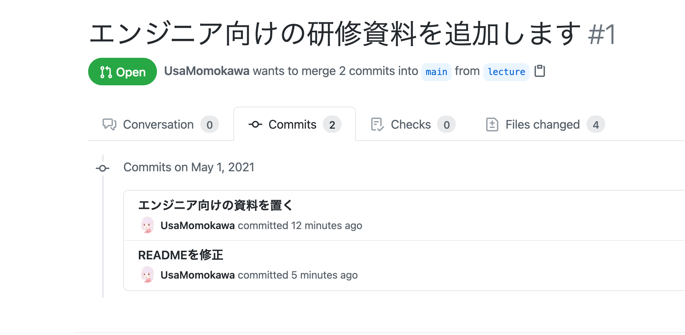

# Git講習

Gitとはなにか、GitとGitHubの違いについて簡単に説明します。

また、Gitにまつわる用語をいくつか紹介します。

- Repository
- Branch
- Commit
- Merge

---
講義の後半では、手を動かして、GitHubにPull Requestを作成してみましょう。

講義の最後にPull Request作成の実演をおこなう予定です。最後まで到達しなくても、一連の手順を見て学べますので、安心して受講してくださいね。

---

# Git
Git(ギット)は、**バージョンを管理**するツールです。バージョンの管理とは、ファイルの変更履歴を残しておくことを指します。

ファイルをコピーして別の名前を付けて保存することも、バージョンを管理する方法のひとつです。


Gitは、バージョンの管理をもっとやりやすいように工夫したツールです。

---
## GitとGitHubの違い
GitとGitHubは名前が似ていますが、Gitはバージョン管理ツールを指し、GitHubはサービスを指しています。GitHubの略称がGitではありません。GitとGitHubは区別しましょう。

GitHubは、Gitで管理したソースコードをオンライン上にホスティングして、複数の開発者で共有できるようにしたサービスです。


---

# GitとGitHubを活用したチーム開発
わたしたちは、GitとGitHubを活用して開発をおこなっています。開発の工程を大まかに3つにわけてみます。

1. 変更を加える
2. 変更を提案する
3. 変更を取り込む

---

# 1. 変更を加える
## Branch
複数の人が並行して開発をおこなうために、GitにはBranch(ブランチ)という機能があります。ブランチは、大まかに「mainブランチ」とそれ以外に分けられます。mainブランチはmasterブランチと呼ばれることもあります。

---

## Commit
ソースコードへの変更は、Commit(コミット)にまとめます。

コミットを小さくするように心がけると、見返した時に作業内容がわかりやすくなりますし、バージョン管理の恩恵が受けられます。

---

## Commit Message



コミットにはコミットメッセージをつけます。コミットメッセージは変更内容を要約して書くことをおすすめします。

コミットメッセージを英語で書くか、日本語で書くかはお任せします(プロジェクトに規則がある場合はそれに従ってください)。

---

## BranchとCommit
変更を加えるときは、本番のmainブランチに影響を与えないように、新しい**ブランチ**を切ります。ソースコードに変更を加えたら、差分を**コミット**します。


これは、lectureブランチを切ってコミットを積んだときの図です。丸が一つのコミットを表しています。

---

# 2. 変更を提案する
## Pull Request
GitHubにPull Request(プルリクエスト)を作成して、「1. 変更を加える」での作業を提案します。

[GitHub Actions](https://github.co.jp/features/actions)等のツールを活用してテストを実行したり、Pull Requestのコメント機能を活用してコードレビューを行ったりもします。


---

## 便利な機能(例)

Files changedから差分を確認できます。


---

# 3. 変更を取り込む
## Merge
Pull Requestに問題がなさそうと合意が取れたら、変更をMerge(マージ)して、mainブランチに取り込みます。

Pull Requestの下にマージボタンがあります。


---

## Mergeされた状態
lectureブランチの矢印がmainに向いており、mainブランチに差分が取り込まれたことを示しています。


---

## まとめ
チーム開発では、「**変更を加える**」「**変更を提案する**」「**変更を取り込む**」を何度も繰り返して成果物を形作っています。

そのためにGitやGitHubの機能を活用しています。

---

# Gitコマンド
Gitにはさまざまなコマンドがあります。Gitをインストールしたら、ターミナルから実行してみましょう。Gitコマンドの一部を掲載しますので、辞書的に参照してみてください。

---

なおサンプルコードには、コマンドの例を示すために、コマンドの最初に`$`や`%`が入っている場合があります。
```
$ git fetch
```

コマンドをコピペするときは、`$`を抜いてから実行してください。
```
git fetch
```

---

## clone
既存のGitリポジトリのコピーを取得したい場合に使うコマンドです。

このリポジトリをSSH経由でクローンする例です。
```bash
$ git clone git@github.com:hayasaki-shunsuke/gtb2021-git.git
```

---

## checkout
作業ブランチを切り替えることをチェックアウトといいます。`-b`(`--branch`)オプションを付与し、ブランチを新しく作りつつブランチを切り替えると楽です。

appleブランチを作成してチェックアウトする例です。
```bash
$ git checkout -b apple
```

---

## status
リポジトリのどのファイルがどの状態にあるのかを表示します。

```
$ git status
```

---

## add
ファイルを変更した差分を[ステージングエリア](https://git-scm.com/book/ja/v2/Git-%E3%81%AE%E5%9F%BA%E6%9C%AC-%E5%A4%89%E6%9B%B4%E5%86%85%E5%AE%B9%E3%81%AE%E3%83%AA%E3%83%9D%E3%82%B8%E3%83%88%E3%83%AA%E3%81%B8%E3%81%AE%E8%A8%98%E9%8C%B2)に登録します(コミットの準備をします)。

`README.md`というMarkdownファイルを登録する例です。
```bash
$ git add README.md
```

---

## commit
ステージングエリアへ追加した差分をコミットします。

`-m`(`--mesage`)オプションをつけると、コミットメッセージを残してコミットします。
```bash
$ git commit -m "READMEを修正"
```

---

## push
変更をリモートリポジトリに共有します。

appleブランチの変更内容をpushする例です。
```bash
$ git push origin apple
```

originとはなんでしょうか？`git remote -v`で見てみましょう。originの指すURLが表示されます。

```bash
$ git remote -v
```

---

## fetch
リモートリポジトリの最新の履歴を取得します。

```bash
$ git fetch
```

---

## merge
ブランチをマージします。競合する変更がなければ自動的にマージコミットが作られます。マージコミットが作られない場合もあり、fast-forwardと呼ばれます。これはローカルリポジトリのブランチに何の変更も行なっていなかった場合の振る舞いです。

```bash
$ git merge
```

`git pull`は、fetchとmergeを組み合わせたものです。

```bash
$ git pull
```

---

## 補足
Gitコマンドについて詳しく知りたい場合は、helpを参照してください。

```bash
$ git help

$ git fetch --help
```

Gitは難しいですが、`Git やりたいこと`で検索するとたくさんの資料がみつかるので、触りながらいろいろ試してみてください。参考資料としては[Pro Git](https://git-scm.com/book/ja/v2/)をおすすめします。
